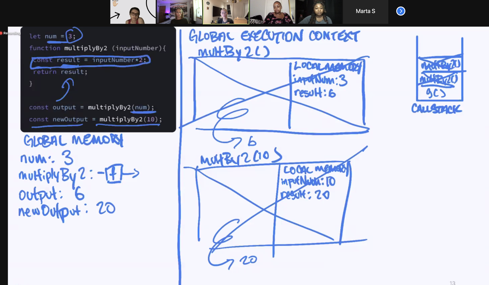

# closure_workshop

Closure is the data that a function has access to when it is called

**Design Patterns**

- **Module Pattern** - closure is important to this

Javascript Engine:

- Global Execution

- Global memory

- Callstack (data structure)

  - as we execute code, we push things on to the call stack

  - We also remove things that have run from the callstack

  - Call Stack is literally a stack (FILO)

  **Order of Ops**

  1. A function is stored in global memory

  2. When function is called, we open up an execution context

  3. Then we push the execution context onto the callstack

